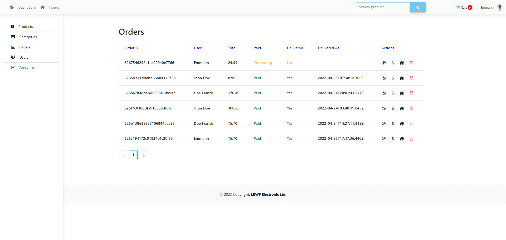
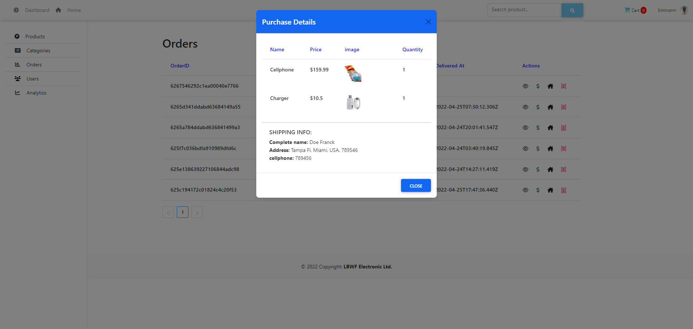

# eshopappltd
 

#### Deploy Link: https://eshopappltd.herokuapp.com/
###### This is an E-commerce Web App implemented with MERN Stack, Redux and Stripe payment. When a user is sign in, we generate a token (JWT), and that token is saved in a cookie (HttpOnly  cookie) for 1h, after this time you will be disconnected.
## Features:
##### - User Dashboard / user profile / purchase history 
##### - Check out process to payment
##### - Admin Dashboard
##### - Automatic logout after 1h.
##### - Automatic product stock management
##### - Purchase history (for Admin)
##### - Pagination Front-End and Backend
##### - Search Product in Frontend
##### - Rating system, user is allowed to post only 1 product review
##### - comment
##### - Add to cart in frontend and in single product
##### - Cart page you can decrease and increae quantity according to the quantity available in the stock
##### - Generate Product order after a successfull payment
##### - Manage orders, products, users, product category in admin dashboard
##### - Stripe payment Gateway

 
 

## Instalation:
- Clone this project: https://github.com/emmannweb/eshopappltd.git
- Run npm install in the root folder and the frontend folder
- create .env file in the root folder abd these variables: NODE_ENV = development, PORT='your port' DATABASE='your mongodb url', JWT_SECRET='your random string',
EXPIRE_TOKEN='for 1h', STRIPE_SECRET_KEY='your stripe key secret'

- last, run in the root folder: npm run server, in the frontend: npm start

## That's it!
###### if you like this project please rate me here, thank you!
