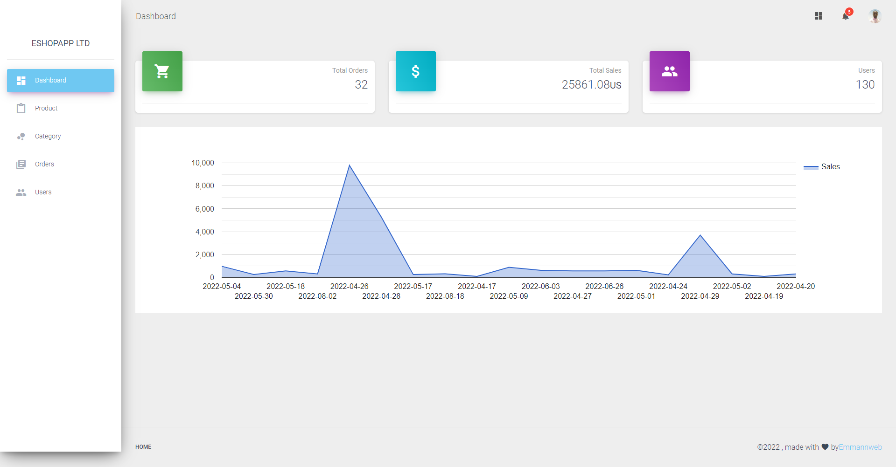
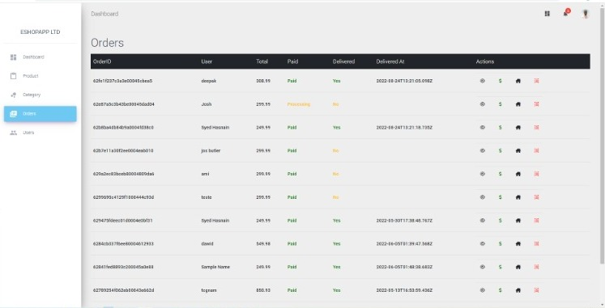
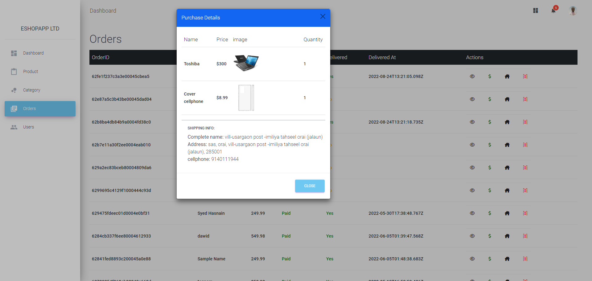
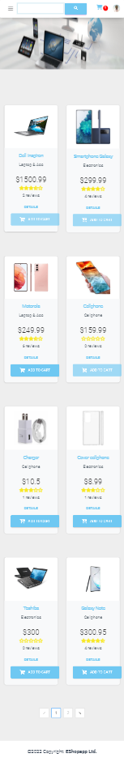
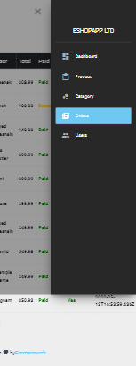

# eshopappltd
eshopappltd is an E-commerce web App made with MERN Stack, Redux and stripe payment gateway. We have implemented a lot of great features. please check README.md and the deployed link.

# Features:
##### - Software Architecture: MVC pattern
##### - HOC (High Order Component)
##### - Dashboard Analytic
##### - Responsive App / UI: Material Design for Bootstrap (MDB)
##### - User Dashboard / user profile / purchase history
##### - Check out process to payment
##### - Admin Dashboard
##### - Automatic logout after 1h.
##### - Automatic product stock management
##### - Purchase history (for Admin).
##### - Pagination Front-End and Backend
##### - Search Product in Frontend
##### - Rating system, user is allowed to post only 1 product review
##### - comment enable when log In
##### - Add to cart in frontend and in single product
##### - Cart page you can decrease and increse quantity according to the quantity available in the stock
##### - Generate Product order after a successfull payment
##### - Manage orders, products, users, product category in admin dashboard
##### - Stripe payment Gateway.
